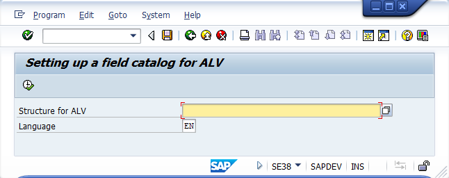
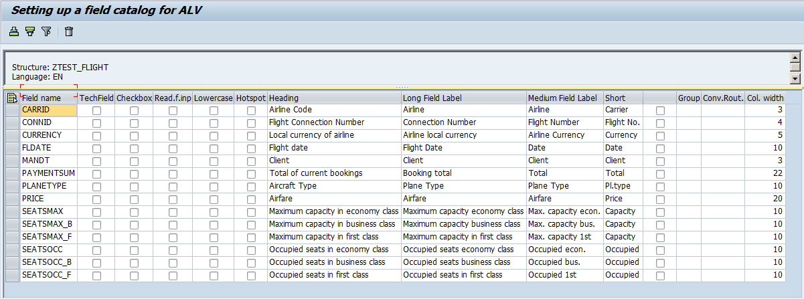

# YDK_ALV_FCAT
Quite often concern ABAP programmer - is the building ALV field catalog.
SAP recommends that you create a table for ALV in the data dictionary, and then no problem getting the catalog.
However, I regularly see SAP code and various third-party where a field catalog filled as you like (append-s, all sorts of macros, loop with setting ...), and I often did so too. 
I'm sick and I decided to solve this problem.
Written by a small group of functions to solve this problem (and not only) which I want to share with you:

``` abap
FUNCTION YDK_ALV_FCAT_BUILD .
*"----------------------------------------------------------------------
*"*"Local Interface:
*"  IMPORTING
*"     REFERENCE(ALV_STRUT_KEY) TYPE  YDK_ALV_STRUTURE_KEY
*"     VALUE(STRUCTURES) OPTIONAL
*"     VALUE(SAVE_EXCLUDE_FILTER) TYPE  CLIKE OPTIONAL
*"     REFERENCE(DEL_OLD_FIELD) TYPE  ABAP_BOOL DEFAULT ABAP_TRUE
*"  TABLES
*"      IN_FCAT OPTIONAL
*"      ALV_TAB
*"      FCAT
```

FM analyzes the structure of the ALV_TAB table, searches for descriptions and settings for table fields in the tables YDK_ALV_FCAT and YDK_ALV_FCAT_TXT, and then fills in the FCAT
If there is a field missing in these tables: 
* FM trying to find a field description by the data element 
* saves the template for tuning tables YDK_ALV_FCAT and YDK_ALV_FCAT_TXT
* if you have the powers of a developer proposes to perform catalog tuning

**main parameters:**
* alv_strut_key - Required, Structure name for the program YDK_ALV_FCAT, this is not a dictionary structure, this is just a global name for identifying a set of fields. I usually do it the same as the program name (if there are several ALVs in the program I add postfixes)
* alv_tab - Required, ALV table for which the field catalog is formed
* fcat - Required, result field catalog for alv_tab

**additional parameters:**
* save_exclude_filter - field mask through ";" for excluding save field in catalog
* del_old_field - delete old (not now exists) field from saved catalog
* structures - Optional, a string with the enumeration through “,” of dictionary structures / tables from which need to take a description for the fields of the table ALV_TAB. The fields are searched by the field name
* in_fcat - Optional, Here you can specify an existing field catalog in which need to add / correct information, data will be combined and transferred to fcat. Used when correct old programs. IN_FCAT is already filled, but you need to add new fields.

in_fcat and fcat - can be catalogs of any type alv: LVC or SLIS, FM itself determines the type of catalog is passed

Another common problem with ALV is the output of transcripts to fields containing code/value, usually a separate field is added, but this is not always convenient,
so I invented a system to execute conversion_exit input/output for fields containing the code/value

``` abap
FUNCTION ydk_conversion_exit_register.
*"----------------------------------------------------------------------
*"*"Локальный интерфейс:
*"  IMPORTING
*"     REFERENCE(FIELDNAME) TYPE  CLIKE
*"     REFERENCE(CALLBACK_PROGRAM) TYPE  CLIKE OPTIONAL
*"     REFERENCE(CALLBACK_FORM) TYPE  CLIKE OPTIONAL
*"     REFERENCE(CALLBACK_INSTANCE) TYPE REF TO  OBJECT OPTIONAL
*"     REFERENCE(CALLBACK_CLASSNAME) TYPE  CLIKE OPTIONAL
*"     REFERENCE(CALLBACK_METHOD) TYPE  CLIKE OPTIONAL
*"     REFERENCE(ROLLNAME) TYPE  CLIKE OPTIONAL
*"     REFERENCE(DOMNAME) TYPE  CLIKE OPTIONAL
*"     REFERENCE(VALUES_TAB) TYPE  VRM_VALUES OPTIONAL
*"     REFERENCE(OUTPUT_LEN) TYPE  I OPTIONAL
*"  CHANGING
*"     REFERENCE(FCAT) TYPE  LVC_T_FCAT
```

FM configures the ALV field catalog entry for the line specified in the fieldname parameter  
customizable fields: convexit, no_convext, outputlen  
49 different conversions can be specified  
There are several variants for setting up the conversion, but only one of them must be selected using the transmitted parameters
If no one parameter is filled in - an attempt is made to obtain a conversion based on the FCAT record data.
** Variants:
*   CALLBACK_FORM - CALLBACK_PROGRAM set automaticly to called FM programm
*   CALLBACK_PROGRAM   + CALLBACK_FORM
*   CALLBACK_INSTANCE  + CALLBACK_METHOD
*   CALLBACK_CLASSNAME + CALLBACK_METHOD
*   ROLLNAME - the corresponding domain must have a set of values
*   DOMNAME - domain must have a set of values
*   VALUES_TAB

** The incoming parameter "kind" in subroutine (form) and methods (see below) can take values:
* "I" - input conversion
* "O" - output conversion

CALLBACK_PROGRAM + CALLBACK_FORM - form defenition:
``` abap
  FORM <form name> USING kind input CHANGING output.
```

CALLBACK_INSTANCE + CALLBACK_METHOD - method defenition:
``` abap
  METHODS <method name>
    IMPORTING
      !kind   TYPE clike
      !input  TYPE any
    EXPORTING
      !output TYPE any.
```

``` abap
CALLBACK_CLASSNAME + CALLBACK_METHOD - method defenition:
  CLASS-METHODS <method name>
    IMPORTING
      !kind   TYPE clike
      !input  TYPE any
    EXPORTING
      !output TYPE any.
```

# Catalog setting tool
To edit YDK_ALV_FCAT and YDK_ALV_FCAT_TXT, the program YDK_ALV_FCAT (transaction YDKFCAT) is made - the program is simple, it allows you to 
* customize the fields of the catalog 
* delete old fields
* write the catalog to the transport request



**List of properties of catalog fields available for customization:**
* TECH - Checkbox, Technical field
* CHECKBOX - Checkbox, Output as checkbox
* EDIT - Checkbox, Ready for input
* HOTSPOT - Checkbox, SingleClick-sensitive
* SP_GROUP - Group key
* LOWERCASE - Checkbox, Lowercase letters allowed/not allowed
* CONVEXIT - Conversion Routine
* EDIT_MASK - ALV control: EditMask for output
* OUTPUTLEN - ALV control: Column width in characters
* IN_FCAT - Checkbox, Settings migrated from inbound catalog
* REPTEXT - Heading
* SCRTEXT_L - Long Field Label
* SCRTEXT_M - Medium Field Label
* SCRTEXT_S - Short Field Label
